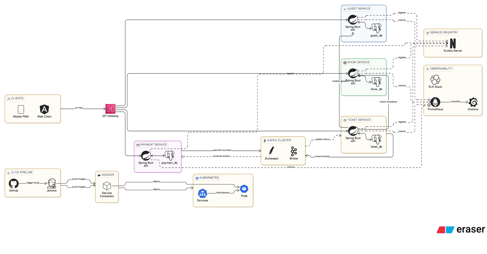

# Imagica Theme Park Management System

A production-style **microservices-based backend system** that simulates a theme park platform similar to Imagica.
The system allows guests to browse shows, view schedules, book tickets, and complete payments through a distributed architecture.

The project demonstrates **modern backend architecture patterns** including microservices, event-driven communication, containerization, and scalable infrastructure. 

[Notion Link](https://reflective-icecream-a6e.notion.site/Imagica-Case-Study-Yuvraj-Naresh-317be36d3c968078935ee9f3f5eabf33)

---

# Architecture Overview

The system is designed using **microservices architecture**, where each service handles a specific business capability and owns its own database.

Core microservices:

* Guest Service
* Show Service
* Ticket Service
* Payment Service

Supporting infrastructure:

* API Gateway
* Service Discovery (Eureka)
* Apache Kafka
* PostgreSQL
* Docker
* Kubernetes (future phase)

Architecture Diagram:




---

# System Architecture

The system follows a layered distributed architecture.

```
Client Applications
        │
        ▼
API Gateway
        │
        ▼
Microservices Layer
 ├── Guest Service
 ├── Show Service
 ├── Ticket Service
 └── Payment Service
        │
        ▼
Event Streaming Layer (Kafka)
        │
        ▼
Database Layer (PostgreSQL per service)
```

Each service communicates via:

* REST APIs (synchronous communication)
* Kafka events (asynchronous communication)

---

# Technology Stack

Backend

* Java 21
* Spring Boot
* Spring Web
* Spring Data JPA
* Hibernate

Messaging

* Apache Kafka
* Spring Kafka

Database

* PostgreSQL

Gateway

* Spring Cloud Gateway

Service Discovery

* Netflix Eureka

Security

* Spring Security
* JWT Authentication

Containerization

* Docker
* Docker Compose

Orchestration (future phase)

* Kubernetes

API Documentation

* OpenAPI / Swagger

Testing

* JUnit
* Mockito
* Spring Boot Test

---

# Microservices

## Guest Service

Manages guest profiles and identity records.

Responsibilities

* Register guest
* Update guest details
* Retrieve guest profile
* Validate guest during booking

Database: **guest_db**

Table: `guest`

| Column     | Description           |
| ---------- | --------------------- |
| id         | Guest identifier      |
| first_name | Guest first name      |
| last_name  | Guest last name       |
| email      | Unique email          |
| phone      | Unique phone          |
| created_at | Creation timestamp    |
| updated_at | Last update timestamp |

Endpoints

```
POST /guests
GET /guests/{id}
PUT /guests/{id}
GET /guests/email/{email}
```

---

## Show Service

Manages theme park shows and schedules.

Responsibilities

* Maintain show catalog
* Manage show schedules
* Track seat availability

Database: **show_db**

Tables

`show`

| Column           | Description     |
| ---------------- | --------------- |
| id               | Show identifier |
| name             | Show name       |
| description      | Description     |
| duration_minutes | Duration        |
| category         | Show category   |

`show_schedule`

| Column      | Description         |
| ----------- | ------------------- |
| id          | Schedule identifier |
| show_id     | Show reference      |
| show_date   | Date                |
| start_time  | Start time          |
| end_time    | End time            |
| total_seats | Total seats         |

`seat_inventory`

| Column          | Description          |
| --------------- | -------------------- |
| id              | Inventory identifier |
| schedule_id     | Schedule reference   |
| available_seats | Available seats      |
| reserved_seats  | Reserved seats       |

Endpoints

```
GET /shows
GET /shows/{id}
GET /shows/{id}/schedules
GET /schedules/{id}/availability
```

---

## Ticket Service

Handles ticket booking and seat allocation.

Responsibilities

* Create ticket bookings
* Allocate seats
* Maintain booking lifecycle
* Validate guest and show availability
* Initiate payment
* Publish booking events

Database: **ticket_db**

Tables

`ticket_booking`

| Column         | Description        |
| -------------- | ------------------ |
| id             | Booking identifier |
| guest_id       | Guest reference    |
| schedule_id    | Show schedule      |
| ticket_count   | Number of tickets  |
| total_price    | Booking cost       |
| booking_status | Booking status     |
| created_at     | Booking timestamp  |

Booking statuses

```
CREATED
PAYMENT_PENDING
CONFIRMED
CANCELLED
```

`ticket`

| Column        | Description       |
| ------------- | ----------------- |
| id            | Ticket identifier |
| booking_id    | Booking reference |
| seat_number   | Seat allocation   |
| ticket_status | Ticket state      |

`booking_status_history`

| Column     | Description        |
| ---------- | ------------------ |
| id         | History identifier |
| booking_id | Booking reference  |
| status     | Status value       |
| updated_at | Status update      |

Endpoints

```
POST /tickets/book
GET /tickets/{bookingId}
PUT /tickets/{bookingId}/cancel
```

---

## Payment Service

Handles payment processing and transaction tracking.

Responsibilities

* Initiate payment
* Track payment lifecycle
* Store transaction details
* Publish payment events

Database: **payment_db**

Tables

`payment`

| Column         | Description               |
| -------------- | ------------------------- |
| id             | Payment identifier        |
| booking_id     | Booking reference         |
| amount         | Payment amount            |
| payment_method | Method used               |
| payment_status | Payment state             |
| transaction_id | Payment gateway reference |
| created_at     | Payment timestamp         |

Payment methods

```
UPI
CARD
NET_BANKING
```

Payment statuses

```
INITIATED
PROCESSING
SUCCESS
FAILED
REFUNDED
```

`payment_status_history`

| Column     | Description        |
| ---------- | ------------------ |
| id         | History identifier |
| payment_id | Payment reference  |
| status     | Status value       |
| updated_at | Status update      |

Endpoints

```
POST /payments/initiate
GET /payments/{id}
PUT /payments/{id}/status
```

---

# Event-Driven Communication

Apache Kafka is used for asynchronous communication.

Kafka Topics

```
ticket-booked
payment-success
payment-failed
```

Event Flow

1. Ticket Service publishes **ticket-booked event**
2. Payment Service consumes the event
3. Payment Service processes payment
4. Payment Service publishes **payment-success or payment-failed**
5. Ticket Service updates booking status

---

# Project Structure

```
imagica-theme-park-system

guest-service
show-service
ticket-service
payment-service

api-gateway
eureka-server

docker-compose.yml
README.md
```

Each service is an independent Spring Boot application.

---

# Running the Project

Prerequisites

* Java 21
* Docker
* Docker Compose
* Maven

Clone repository

```
git clone https://github.com/your-repo/imagica-theme-park-system
```

Start infrastructure

```
docker-compose up
```

Run services

```
mvn spring-boot:run
```

Access APIs through API Gateway.

---

# Future Enhancements

* Notification Service (email/SMS alerts)
* Seat selection visualization
* Recommendation system for shows
* Analytics and reporting service
* Real payment gateway integration
* Kubernetes deployment

---

# Purpose of the Project

This project demonstrates:

* Microservices architecture design
* Event-driven communication with Kafka
* Distributed system patterns
* Scalable backend system development
* Containerized deployment using Docker

It serves as a **real-world backend architecture reference for distributed systems development**.
